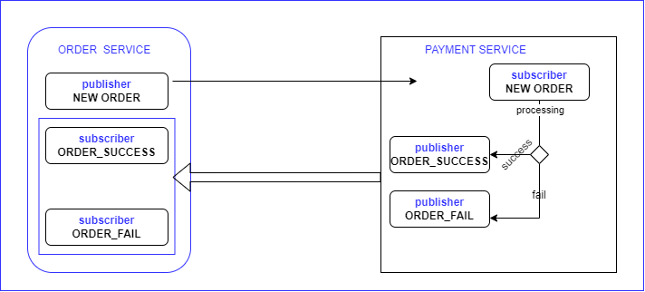

### Redis Microservice Communication Example
---

Step 1 : Run Redis docker container  
    `docker run --name redispubsub -p 6379:6379 -d redis`

Step 2 : Start the Order service inside `OrderService` directory using `npm start` 
Step 3 : Start payment service inside `PaymentService` directory  using `npm start`
